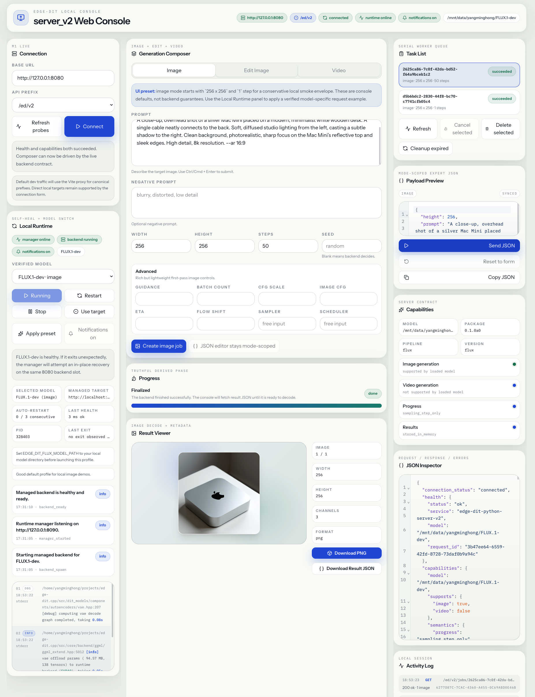

# API and Bindings

[← Back to README](../README.md)

edge-dit.cpp exposes a public C API, native server binaries, Python bindings,
and a Python job-style HTTP server.

## C API

The public C API is declared in:

```text
include/edge-dit.h
```

Main lifecycle:

```c
ed_context_params_t ctx_params;
ed_context_params_init(&ctx_params);
ctx_params.model_path = "/path/to/model-dir";

ed_context_t * ctx = ed_create_context(&ctx_params);
if (ctx == NULL) {
    /* handle model load error */
}

ed_free_context(ctx);
```

The context owns model/runtime state. Generated image and video buffers must be
released with the matching `ed_free_*` function.

## Version API

```c
const char * ed_version_string(void);
int ed_version_major(void);
int ed_version_minor(void);
int ed_version_patch(void);
```

For v0.1.0 these return `0.1.0`, `0`, `1`, and `0`.

## Image Generation

```c
ed_image_generation_params_t params;
ed_image_generation_params_init(&params);
params.prompt = "a glass teapot on a wooden table";
params.width = 1024;
params.height = 1024;
params.seed = 0;
params.sample.steps = 20;

ed_image_batch_t out;
ed_status_t status = ed_generate_image(ctx, &params, &out);
if (status == ED_STATUS_OK) {
    /* use out.images */
    ed_free_image_batch(&out);
}
```

The image request supports prompts, negative prompts, image inputs, masks,
control images, reference images, LoRA entries, and cache/sample settings.

## Video Generation

```c
ed_video_generation_params_t params;
ed_video_generation_params_init(&params);
params.prompt = "a glass teapot rotating on a wooden table";
params.width = 832;
params.height = 480;
params.frames = 40;
params.seed = 0;
params.sample.steps = 20;

ed_video_t out;
ed_status_t status = ed_generate_video(ctx, &params, &out);
if (status == ED_STATUS_OK) {
    /* use out.frames */
    ed_free_video(&out);
}
```

Video support is currently focused on Wan-family pipelines.

## Error Handling

Most calls return `ed_status_t`.

```c
const char * err = ed_get_last_error(ctx);
```

Useful status values include:

- `ED_STATUS_OK`
- `ED_STATUS_INVALID_ARGUMENT`
- `ED_STATUS_MODEL_LOAD_FAILED`
- `ED_STATUS_GENERATION_FAILED`
- `ED_STATUS_OUT_OF_MEMORY`
- `ED_STATUS_UNSUPPORTED`
- `ED_STATUS_CANCELLED`

## Capability Checks

```c
const char * ed_context_pipeline_name(const ed_context_t * ctx);
const char * ed_context_version_name(const ed_context_t * ctx);
bool ed_context_supports_image(const ed_context_t * ctx);
bool ed_context_supports_video(const ed_context_t * ctx);
ed_sampler_t ed_context_default_sampler(const ed_context_t * ctx);
ed_scheduler_t ed_context_default_scheduler(const ed_context_t * ctx, ed_sampler_t sampler);
int ed_context_parallel_rank(const ed_context_t * ctx);
int ed_context_parallel_world_size(const ed_context_t * ctx);
bool ed_context_parallel_is_root(const ed_context_t * ctx);
```

Cancellation and progress polling:

```c
void ed_context_request_cancel(ed_context_t * ctx);
int ed_context_progress_current_step(const ed_context_t * ctx);
int ed_context_progress_total_steps(const ed_context_t * ctx);
```

## Native HTTP Server

`ed-server` is a native HTTP wrapper around the C API.

Start:

```bash
./build-cuda/bin/ed-server \
  --backend cuda \
  --model /path/to/flux-dev \
  --host 127.0.0.1 \
  --port 8080
```

Canonical endpoints:

- `GET /ed/v1/health`
- `GET /ed/v1/models`
- `GET /ed/v1/capabilities`
- `POST /ed/v1/images/generations`

Aliases are also registered for `/edgedit/v1/...` and `/edge-dit/v1/...`.

Example:

```bash
curl -s http://127.0.0.1:8080/ed/v1/images/generations \
  -H 'Content-Type: application/json' \
  -d '{
    "prompt": "a glass teapot on a wooden table",
    "width": 1024,
    "height": 1024,
    "steps": 20,
    "seed": 0
  }'
```

See [examples/server/README.md](../examples/server/README.md) for the native
server details.

## Python Bindings

The Python package lives under:

```text
bindings/python/src/edge_dit/
```

The distribution metadata lives in `bindings/python/pyproject.toml`. The
installed package name is `edge-dit-python`; the import package is
`edge_dit`.

Basic usage:

```python
from edge_dit import Engine, EngineConfig, ImageRequest

config = EngineConfig(model_path="/path/to/FLUX.1-dev", backend="cuda")
request = ImageRequest(
    prompt="a glass teapot on a wooden table",
    width=1024,
    height=1024,
    steps=20,
    seed=0,
)

with Engine(config) as engine:
    images = engine.generate_image(request)
    images[0].save("output.png")
```

If you need NumPy outputs instead of Pillow images, install the optional extra:

```bash
pip install '.[numpy]'
```

### Public package surface

The package currently re-exports the main configuration, request, engine, and
error types:

```python
from edge_dit import (
    EdgeDitClosedError,
    EdgeDitError,
    EdgeDitLibraryError,
    Engine,
    EngineConfig,
    GenerationCancelledError,
    GenerationError,
    ImageRequest,
    InvalidArgumentError,
    ModelLoadError,
    UnsupportedError,
    UnsupportedImageFormatError,
    VideoRequest,
)
```

### Engine lifecycle

`Engine` wraps a single native `ed_context_t`.

- Construct it with an `EngineConfig` instance.
- Or construct it directly from `model_path` plus keyword arguments.
- Close it explicitly with `close()` or use it as a context manager.
- After `close()`, any further operation raises `EdgeDitClosedError`.
- Generation calls are serialized per engine instance by an internal lock.

Runtime query and control methods:

- `engine.pipeline_name -> str | None`
- `engine.version_name -> str | None`
- `engine.supports_image -> bool`
- `engine.supports_video -> bool`
- `engine.default_sampler -> int`
- `engine.default_scheduler(sampler: int | str | None = None) -> int`
- `engine.progress_steps() -> tuple[int, int]`
- `engine.request_cancel() -> None`
- `engine.generate_image(...) -> list[PIL.Image.Image] | list[numpy.ndarray]`
- `engine.generate_video(...) -> list[PIL.Image.Image] | list[numpy.ndarray]`

The polling and cancellation surface is intentionally narrow:

- `progress_steps()` reports sampling-step progress only.
- It does not include prompt encoding, VAE decode, or output encoding.
- `request_cancel()` is cooperative and takes effect at native step boundaries.

### EngineConfig

`EngineConfig` validates inputs on construction. A configuration must provide
either:

- `model_path`
- Or a component set containing `diffusion_model_path`, `vae_path`,
  `clip_l_path`, and either `t5xxl_path` or `skip_t5=True`

Important fields include:

- Model/component paths:
  `model_path`, `diffusion_model_path`, `high_noise_diffusion_model_path`,
  `clip_l_path`, `clip_g_path`, `clip_vision_path`, `t5xxl_path`, `llm_path`,
  `llm_vision_path`, `vae_path`, `taesd_path`, `control_net_path`
- Runtime/backend:
  `backend`, `n_threads`, `weight_type`, `tensor_type_rules`, `use_mmap`
- Memory/offload:
  `offload_params_to_cpu`, `keep_text_encoder_on_cpu`,
  `keep_control_net_on_cpu`, `keep_vae_on_cpu`, `max_vram_gb`
- Model/runtime options:
  `skip_t5`, `flash_attention`, `vae_tiling`, `vae_tile_size`
- Parallelism:
  `cfg_parallel_size`, `tp_parallel_size`, `sp_parallel_size`

`weight_type` accepts either an integer native enum value or a normalized string
alias such as `auto`, `f16`, `bf16`, `q4_0`, or `q4_k`.

### ImageRequest

`ImageRequest` validates inputs on construction and requires a non-empty
`prompt`.

Common generation fields:

- `prompt`, `negative_prompt`
- `width`, `height`, `seed`
- `steps`, `cfg_scale`, `guidance`, `distilled_guidance`, `eta`, `flow_shift`
- `sampler`, `scheduler`

Image-specific fields:

- `batch_count`
- `image_cfg_scale`
- `init_image`, `mask_image`, `control_image`
- `ref_images`
- `output_type`

Cache-tuning fields mirror the current native sample-parameter surface:

- `cache_mode`
- `cache_reuse_threshold`
- `cache_start_percent`, `cache_end_percent`
- `cache_error_decay_rate`
- `cache_use_relative_threshold`
- `cache_reset_error_on_compute`
- `cache_Fn_compute_blocks`, `cache_Bn_compute_blocks`
- `cache_residual_diff_threshold`
- `cache_max_accumulated_residual_diff`
- `cache_max_warmup_steps`
- `cache_max_cached_steps`
- `cache_max_continuous_cached_steps`
- `cache_taylorseer_n_derivatives`
- `cache_taylorseer_skip_interval`
- `cache_scm_mask`
- `cache_scm_policy_dynamic`

Notes:

- `init_image`, `mask_image`, `control_image`, and `ref_images` must be
  `PIL.Image.Image` values.
- `ref_images` must be a non-empty `list` or `tuple` when provided.
- `output_type` may be `pil` or `numpy`.
- `guidance` and `distilled_guidance` map to the same native field; if both are
  provided they must match.
- Keyword-style calls also accept `batch_size` as an alias for `batch_count`.

### VideoRequest

`VideoRequest` follows the same validation style as `ImageRequest` and requires
a non-empty `prompt`.

Fields:

- `prompt`, `negative_prompt`
- `width`, `height`, `frames`, `seed`
- `steps`, `cfg_scale`, `guidance`, `distilled_guidance`, `eta`, `flow_shift`
- `sampler`, `scheduler`
- `output_type`

`output_type` may be `pil` or `numpy`. As with `ImageRequest`, `guidance` and
`distilled_guidance` must match when both are provided.

### Output formats

By default, image generation returns `list[PIL.Image.Image]` and video
generation returns `list[PIL.Image.Image]` frames.

If `output_type="numpy"` is requested and NumPy is installed:

- grayscale outputs use shape `(height, width)`
- RGB/RGBA outputs use shape `(height, width, channels)`

### Enum arguments

`weight_type`, `sampler`, `scheduler`, and `cache_mode` accept either integer
native values or string aliases. String names are normalized across `-`, `_`,
`.`, and spaces.

Accepted aliases in the Python binding include:

- Samplers: `euler`, `dpm++-2m`, `ddim`, `tcd`
- Schedulers: `discrete`, `karras`, `simple`, `lcm`
- Cache modes: `disabled`, `easycache`, `ucache`, `dbcache`, `taylorseer`,
  `cache-dit`

Successful alias resolution only means the Python binding can map the string to
the corresponding native enum. It does not guarantee that every loaded model or
pipeline implements identical behavior for that setting. For example, some
pipelines restrict sampler choices or ignore unsupported overrides.

### Exceptions

The Python bindings raise typed runtime errors:

- `EdgeDitLibraryError` when the shared library cannot be loaded
- `ModelLoadError` when a native context cannot be created
- `InvalidArgumentError` for request/config validation failures
- `GenerationError` for generation failures and empty native outputs
- `GenerationCancelledError` for cooperative cancellation
- `UnsupportedError` for unsupported features or capability mismatches
- `UnsupportedImageFormatError` when native output channels cannot be converted

Generation and load failures are enriched with Python-side context such as model
paths, backend, size, steps, seed, and selected output type.

For local test runs from the repository root:

```bash
PYTHONPATH=bindings/python/src python3 -m pytest bindings/python/tests
```

See [bindings/python/README.md](../bindings/python/README.md) for more Python
examples.

<a id="python-server-v2"></a>

## Python server_v2

The Python bindings include a job-style HTTP server built directly on top of the
Python `Engine`. The current runtime executes one job at a time and stores
terminal job metadata/results in memory until TTL cleanup removes them.

Start it from the repository root:

```bash
PYTHONPATH=bindings/python/src \
python -m edge_dit.server_v2 \
  --model /path/to/model \
  --backend cuda \
  --host 127.0.0.1 \
  --port 8080
```

If the package is installed, the same entrypoint is also exposed as:

```bash
edge-dit-server-v2 --model /path/to/model --backend cuda
```

Useful CLI flags include:

- `--model`
- `--diffusion-model`, `--vae`, `--clip_l`, `--clip_g`, `--t5xxl`
- `--backend`, `--threads`, `--max-vram`
- `--offload-to-cpu`, `--keep-text-encoder-on-cpu`, `--keep-vae-on-cpu`
- `--skip-t5`
- `--job-ttl-seconds`

Passing a negative `--job-ttl-seconds` disables automatic cleanup.

Canonical endpoints:

- `GET /`
- `GET /ed/v2/health`
- `GET /ed/v2/capabilities`
- `POST /ed/v2/images/generations`
- `POST /ed/v2/videos/generations`
- `GET /ed/v2/jobs`
- `POST /ed/v2/jobs/cleanup`
- `GET /ed/v2/jobs/{job_id}`
- `POST /ed/v2/jobs/{job_id}/cancel`
- `GET /ed/v2/jobs/{job_id}/result`
- `DELETE /ed/v2/jobs/{job_id}`

Aliases are also registered for `/edgedit/v2/...` and `/edge-dit/v2/...`.

### Capabilities and health

`GET /ed/v2/health` returns a lightweight health payload.

`GET /ed/v2/capabilities` returns a runtime description including:

- service and package version
- configured model name
- pipeline and version names from the loaded engine
- `supports.image` and `supports.video`
- default sampler and scheduler
- endpoint aliases
- server semantics such as progress granularity, cancellation mode, result
  retention, and job TTL

### Image job requests

`POST /ed/v2/images/generations` accepts the `ImageRequest` surface as JSON,
except that server-side results are always stored as PNG-encoded Pillow outputs.

The endpoint additionally accepts:

- `cache`, a nested JSON object that maps onto the `cache_*` request fields
- `init_image_b64`
- `mask_image_b64`
- `control_image_b64`
- `ref_images_b64`

These image fields accept either raw base64 bytes or `data:image/...;base64,...`
URLs. The server decodes them to `PIL.Image.Image` before calling the engine.

Example:

```bash
curl -s http://127.0.0.1:8080/ed/v2/images/generations \
  -H 'Content-Type: application/json' \
  -d '{
    "prompt": "a cinematic photo of a glass teapot on a wooden table",
    "width": 1024,
    "height": 1024,
    "steps": 20,
    "guidance": 3.5,
    "cache": {
      "mode": "disabled"
    }
  }'
```

### Video job requests

`POST /ed/v2/videos/generations` accepts the `VideoRequest` JSON surface.

Example:

```bash
curl -s http://127.0.0.1:8080/ed/v2/videos/generations \
  -H 'Content-Type: application/json' \
  -d '{
    "prompt": "a small robot walking through a rainy neon street",
    "width": 416,
    "height": 240,
    "frames": 9,
    "steps": 20,
    "cfg_scale": 5.0,
    "flow_shift": 5.0
  }'
```

### Job lifecycle

Create endpoints return HTTP `202 Accepted` plus a job object containing:

- `id`
- `kind`
- `model`
- `status`
- `created_ms`, `started_ms`, `finished_ms`, `expires_ms`
- `cancel_requested`
- `progress`
- normalized `parameters`
- `error`
- `status_url`, `cancel_url`, `result_url`

Job statuses are:

- `queued`
- `running`
- `cancelling`
- `succeeded`
- `failed`
- `cancelled`

Behavioral notes:

- Progress is sampling-step only.
- Cancellation is cooperative and forwarded to `engine.request_cancel()`.
- `DELETE /ed/v2/jobs/{job_id}` is only allowed after the job reaches a
  terminal state.
- `GET /ed/v2/jobs` supports `status`, `kind`, and `limit` query parameters.
- `POST /ed/v2/jobs/cleanup` optionally accepts `{"now_ms": ...}` and returns
  the removed job ids.

### Result payloads

Successful image jobs return:

- `object: "edge_dit.image_generation"`
- `id`
- `model`
- `created_ms`, `completed_ms`
- normalized `parameters`
- `data[]`, where each item contains `b64_png` plus `metadata`

Successful video jobs return:

- `object: "edge_dit.video_generation"`
- `id`
- `model`
- `created_ms`, `completed_ms`
- normalized `parameters`
- `frame_format: "png"`
- `frames[]`, where each item contains `b64_png` plus `metadata`

Both result forms currently PNG-encode every image/frame in memory before
returning JSON.

### Error format

Structured errors use a JSON envelope:

```json
{
  "error": {
    "message": "prompt is required",
    "type": "invalid_request_error",
    "code": "invalid_request",
    "status": 400,
    "request_id": "..."
  }
}
```

The server also returns `X-Request-ID` in response headers and mirrors that id
into successful JSON responses as `request_id`.

## Frontend Console

A development console is available at:

```text
bindings/python/frontend/server_v2-console/
```



Example session with a managed local `FLUX.1-dev` image backend.

It is intended for local development and demonstration. It is not a stable API
contract.

The console is organized into three working areas:

- Left rail: `Connection` probes an existing `server_v2` target by base URL and
  API prefix. `Local Runtime` manages a verified local profile, exposes runtime
  health, and surfaces recent manager/backend events.
- Center rail: `Generation Composer` is the main request editor. Select
  `Image`, `Edit Image`, or `Video`, fill the request form, submit a job, then
  watch `Progress` and inspect the decoded output in `Result Viewer`.
- Right rail: `Task List` tracks queued and completed jobs. `Payload Preview`,
  `Capabilities`, `JSON Inspector`, and `Activity Log` help compare the live
  backend contract, the normalized request payload, and recent HTTP activity.

Typical local workflow:

1. Start the managed stack with `npm run dev:managed`, or launch the frontend
   and backend separately.
2. In `Connection`, point the console at the backend, typically
   `http://127.0.0.1:8080` with the `/ed/v2` prefix, then refresh probes and
   connect.
3. If you are using the managed local runtime, choose a verified model profile
   in `Local Runtime` and use the runtime controls to start, restart, or stop
   the backend.
4. In `Generation Composer`, choose the mode, enter the prompt and parameters,
   and create a job.
5. Watch `Task List` and `Progress` while the job runs. When it completes, use
   `Result Viewer` to inspect the decoded image/video output and download the
   rendered asset or raw result JSON.
6. Use `Payload Preview`, `Capabilities`, `JSON Inspector`, and the runtime log
   panels when you need to debug mismatched requests, unexpected server
   behavior, or model-profile configuration issues.

For setup and launch commands, see
[README.md](../bindings/python/frontend/server_v2-console/README.md) and
[RUNTIME_CONFIGURATION.md](../bindings/python/frontend/server_v2-console/RUNTIME_CONFIGURATION.md).

## API Stability

The API is public but not stable. During the v0.x series:

- C API structs and functions may change.
- ABI compatibility is not guaranteed.
- CLI flags may be renamed or reorganized.
- HTTP server response schemas may evolve.
- Python binding behavior may change as the C API settles.

## Related Documentation

- [Build and installation](build.md)
- [Command line usage](cli.md)
- [Supported models and usage](models.md)
- [Performance and optimization](performance.md)
- [Development and contributing](development.md)
